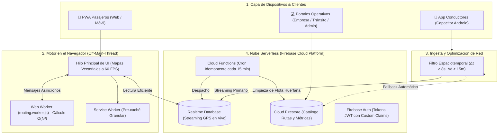

  

  # 🚌 Solibus — Plataforma Tecnológica para el Transporte Público Colectivo
  
  **Estudio de Caso Técnico & Portafolio de Arquitectura de Software**  
  *Sistema integral de telemetría IoT de alta concurrencia, motor de ruteo asíncrono y Progressive Web App multiplataforma.*

  
  
  
  

   
  

---

## 📌 Sobre el Proyecto

En ciudades intermedias de Latinoamérica, el transporte público colectivo suele carecer de información en tiempo real sobre rutas, paraderos y frecuencias de paso. Esto genera altos tiempos de espera e incertidumbre para miles de ciudadanos y dificulta la fiscalización por parte de las empresas de transporte y autoridades de movilidad.

**Solibus** es una solución tecnológica integral diseñada y desarrollada para modernizar el sistema de transporte de Sogamoso (Boyacá, Colombia), articulando las necesidades de 5 actores clave:

1. **Pasajeros:** Planificación de viajes multimodal, tiempos de llegada estimados (ETA) y visualización en vivo de buses en movimiento sobre mapas vectoriales interactivos.
2. **Conductores:** Aplicación móvil ligera con telemetría GPS automática de bajo consumo de datos, modo de conducción y alertas de paraderos.
3. **Empresas Transportadoras:** Monitoreo de flota, cálculo de intervalos y auditoría de despacho.
4. **Autoridad de Tránsito (Intrasog):** Supervisión de cobertura, velocidades operativas e inspección de servicios públicos.
5. **Administración Central:** Gestión paramétrica del parque automotor, trazado de rutas y auditoría de seguridad.

---

## ⚙️ Tecnologías Utilizadas

| Capa | Tecnologías | Propósito |
| :--- | :--- | :--- |
| **Frontend Web** | JavaScript Moderno (ES6+), HTML5 Semántico, CSS3 Responsivo | Renderizado ultra-rápido sin sobrecarga de frameworks en dispositivos gama media/baja. |
| **Arquitectura Móvil** | Progressive Web App (PWA), Service Workers, Capacitor | Soporte offline, instalación nativa en Android y rendimiento de 60 FPS. |
| **Cómputo en Cliente** | Web Workers (`routing.worker.js`) | Aislamiento de cálculos pesados de ruteo fuera del hilo principal (*Off-Main-Thread*). |
| **Mapas Vectoriales** | Google Maps JavaScript API (`AdvancedMarkerElement`) | Visualización fluida de geometrías de rutas y marcadores dinámicos de buses. |
| **Backend Serverless** | Firebase Cloud Functions (Node.js) | Tareas programadas idempotentes (Cron), depuración de flota y gestión de Custom Claims. |
| **Bases de Datos Duales** | Firebase Realtime Database (RTDB) & Cloud Firestore | RTDB para streaming continuo de telemetría a bajo costo; Firestore para catálogos y perfiles. |
| **Seguridad** | Firebase Auth (Custom Claims), Firestore Security Rules, CSP | Autenticación criptográfica, RBAC estricto y prevención de suplantación vehicular. |
| **Calidad y DevOps** | Test runner nativo de Node.js (`node:test`), Terser Minifier | Pipeline de pruebas unitarias (`haversine`, `throttling`, `xss`) y compilación no destructiva. |

---

## 🏛️ Arquitectura de Alto Nivel

Para una explicación pormenorizada de cada subsistema, consulta la [Documentación de Arquitectura](docs/architecture.md).

---

## 🚀 Aspectos Técnicos Destacados (Technical Highlights)

- **Reducción del 85% en Costos de Base de Datos:** Desacoplamiento de la telemetría de alta frecuencia hacia Realtime Database (facturación por ancho de banda ~$1 USD/GB) combinado con filtrado espaciotemporal inteligente, evitando millones de escrituras costosas en bases de datos documentales.
- **Ruteo Asíncrono a 60 FPS:** Migración de los cálculos cuadráticos de transbordos y proyecciones geodésicas a un Web Worker, eliminando por completo los congelamientos de pantalla (*UI jank*).
- **Ahorro de Datos Móviles (-1.2 MB de Descarga Inicial):** Rediseño quirúrgico del Service Worker para descargar exclusivamente los assets esenciales del pasajero en redes 3G/4G móviles.
- **Seguridad Inmutable contra Suplantación:** Reglas declarativas a nivel de base de datos que exigen validación criptográfica de propiedad vehicular (`resource.data.conductorId == request.auth.uid`).
- **Arquitectura de Resiliencia en Red:** Mecanismo de conmutación automática (*failover*) que detecta fallos de socket en RTDB y transiciona en caliente a Firestore en menos de 2.5 segundos.

---

## 💡 Desafíos de Ingeniería y Soluciones (Challenges & Solutions)

### 1. Saturación de Costos por Telemetría GPS Continua
* **El Problema:** Con 150 buses emitiendo coordenadas cada segundo directamente a Cloud Firestore, el sistema generaba más de 540,000 operaciones de escritura por hora, sobrepasando las cuotas de nube y generando costos desmedidos de facturación.
* **La Solución:** Se diseñó un algoritmo de *Throttling Espaciotemporal* basado en la fórmula de Haversine que solo transmite si el bus recorrió $\ge 15$ metros o transcurrieron $\ge 8$ segundos desde el último despacho. Además, se migró el canal en vivo a Realtime Database.
* **El Resultado:** Reducción de más de un 80% en el volumen de transferencias, permitiendo monitorear flotas masivas con costos de infraestructura inferiores a $15 USD mensuales.  
  *(Ver detalles en [docs/telemetry-and-cost-optimization.md](docs/telemetry-and-cost-optimization.md)).*

### 2. Congelamiento de la Interfaz al Calcular Transbordos
* **El Problema:** La búsqueda de trayectos óptimos y transbordos requería iterar decenas de polilíneas, calcular distancias ortodrómicas y ordenar candidatos ($O(N^2)$), congelando el renderizado de la UI entre 400ms y 1.2 segundos en teléfonos móviles.
* **La Solución:** Encapsulamiento del motor de ruteo en un **Web Worker** con protocolo de mensajería asíncrono y watchdog timer de contingencia de 2.5 segundos.
* **El Resultado:** Tasa constante de **60 cuadros por segundo (FPS)** en la vista del mapa durante búsquedas complejas.  
  *(Ver detalles en [docs/off-main-thread-routing.md](docs/off-main-thread-routing.md)).*

### 3. Exposición de Secretos en el Binario Móvil
* **El Problema:** Compilaciones anteriores de Android empaquetaban scripts de administración y credenciales maestras dentro del APK.
* **La Solución:** Refactorización del pipeline de empaquetado en `build-apk.bat` mediante exclusión estricta de archivos con Robocopy e inyección de contraseñas de Keystore exclusivamente por variables de entorno del sistema operativo.
* **El Resultado:** APK/AAB 100% blindado contra ingeniería inversa y descompilación.  
  *(Ver detalles en [docs/security-and-rbac.md](docs/security-and-rbac.md)).*

---

## 📐 Decisiones de Arquitectura Relevantes (Architecture Decisions)

| Decisión | Justificación Técnica | Consecuencia / Trade-off |
| :--- | :--- | :--- |
| **Arquitectura Dual de Base de Datos (RTDB + Firestore)** | Aprovechar el modelo de facturación por ancho de banda de RTDB para streaming continuo y la riqueza de consultas de Firestore para catálogos. | Requiere mantener sincronizados esquemas lógicos y manejar fallback de red. |
| **Vanilla JS Estructurado vs. Framework Pesado** | Dispositivos móviles de pasajeros en paraderos urbanos poseen CPU y memoria limitadas. Se priorizó un bundle JS ligero (~560 KB minificado). | Mayor disciplina en la gestión manual del DOM y ciclo de vida de componentes. |
| **Custom Claims en JWT vs. Consultas a BD** | Estampar roles en el token de autenticación elimina una lectura de base de datos en cada petición a la API. | La propagación de cambios de rol requiere refrescar el token de sesión del usuario. |
| **Compilación No Destructiva con Terser** | Separar el directorio de salida (`dist/`) del código fuente original. | El código en desarrollo se mantiene legible y desacoplado de las optimizaciones de producción. |

---

## 🛡️ Seguridad y Control de Acceso

El sistema implementa el principio de **Defensa en Profundidad**:
1. **Control de Acceso Basado en Roles (RBAC):** Separación estricta de privilegios entre Pasajeros, Conductores, Empresas, Autoridades de Tránsito y Super-Administradores.
2. **Validación Declarativa en Firestore:** Reglas que validan tipos de datos, longitud de strings, inmutabilidad de IDs de conductor y pertenencia de empresa.
3. **Mitigación XSS:** Utilidades de sanitización contextual aplicadas antes de renderizar cualquier entrada de usuario en el DOM.
4. **Política de Seguridad de Contenido (CSP):** Restricción de dominios permitidos para scripts, WebSockets y conexiones de red en `firebase.json`.

---

## 📱 Plataformas Soportadas

- **Web Desktop & Mobile:** Compatible con motores Chromium, WebKit y Gecko.
- **Progressive Web App (PWA):** Instalable en la pantalla de inicio con soporte de caché offline para catálogos de transporte.
- **Android:** Aplicación empaquetada mediante Capacitor con permisos de geolocalización en primer y segundo plano.

---

## 🚦 Estado del Proyecto

- **Estado:** Proyecto en fase de producción y pruebas operativas en Sogamoso, Boyacá.
- **Naturaleza:** Sistema de software propietario con fines de modernización del transporte público urbano.

---

## 📚 Documentación Técnica Detallada

Para profundizar en la ingeniería del proyecto, consulta los documentos de la carpeta `docs/`:

1. [📐 Arquitectura General del Sistema](docs/architecture.md)
2. [⚡ Telemetría y Optimización de Costos de Nube](docs/telemetry-and-cost-optimization.md)
3. [🧵 Motor de Ruteo Asíncrono Off-Main-Thread](docs/off-main-thread-routing.md)
4. [🔒 Seguridad, RBAC y Reglas de Base de Datos](docs/security-and-rbac.md)
5. [📋 Registro Exhaustivo de Desafíos y Decisiones](docs/challenges-and-decisions.md)

---

## ⚖️ Aviso Legal y Propiedad Intelectual

> **Nota sobre el Código Fuente:**  
> Por motivos de confidencialidad, acuerdos operativos y protección de propiedad intelectual, el código fuente completo ejecutable, geometrías de red completas y credenciales de despliegue se mantienen en un repositorio privado de desarrollo.  
>  
> Este repositorio público fue concebido y estructurado exclusivamente como un **estudio de caso técnico y portafolio profesional de arquitectura de software**. Para solicitudes de demostración o consultas técnicas, por favor contactar al autor.

© 2026 Solibus. Todos los derechos reservados.
