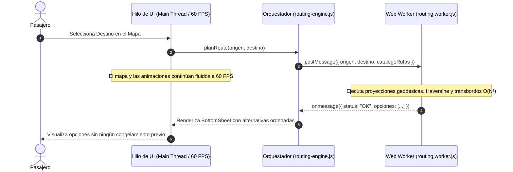

# 🧵 Motor de Ruteo Asíncrono Off-Main-Thread (Web Workers)

Este documento detalla la arquitectura de rendimiento aplicada en la aplicación de pasajeros de **Solibus** para garantizar una tasa de cuadros estable de **60 FPS** al calcular alternativas de viaje y transbordos en dispositivos móviles.

---

## 1. El Problema del Bloqueo del Hilo Principal

En aplicaciones web y móviles basadas en navegadores (como las PWA), la ejecución de JavaScript comparte un **único hilo principal (*Main Thread*)** con las siguientes tareas críticas:
- Renderizado y composición de la interfaz de usuario (DOM).
- Manipulación y desplazamiento del mapa vectorial de Google Maps.
- Detección de eventos táctiles, animaciones y gestos en pantalla.

### Complejidad del Algoritmo de Tránsito
Para sugerir cómo llegar desde el punto $A$ (origen del usuario) al punto $B$ (destino), el motor debe resolver:
1. Proyección ortogonal de $A$ y $B$ sobre decenas de polilíneas que contienen miles de vértices geodésicos.
2. Identificación de rutas directas con paraderos de abordaje y descenso a distancias caminables ($\le 500\text{ m}$).
3. Búsqueda combinatoria de **transbordos (Ruta 1 + Conexión + Ruta 2)** con intersección espacial de geometrías.

Esta evaluación presenta una complejidad algorítmica cuadrática **$O(N^2)$** en relación con el número de segmentos de red evaluados.

En dispositivos móviles de gama económica (con procesadores de rendimiento monohilo moderado), ejecutar este algoritmo en el hilo principal congelaba la pantalla entre **400 milisegundos y 1.2 segundos**, provocando que el mapa dejara de responder a los gestos del usuario (*Jank / Frame Drops*).

---

## 2. Arquitectura de Desacoplamiento con Web Worker

Para eliminar el congelamiento de la interfaz, el motor de ruteo fue completamente encapsulado dentro de un **Web Worker** en segundo plano (`routing.worker.js`).



---

## 3. Manejo de Resiliencia y Mecanismo Watchdog

Aunque los Web Workers están soportados en todos los navegadores modernos, las redes móviles o dispositivos con memoria severamente limitada pueden experimentar fallas de inicialización o cuelgues del hilo secundario.

Para garantizar que el usuario nunca quede atrapado en una pantalla de carga infinita, el orquestador implementa una **estrategia de contingencia con temporizador de guarda (*Watchdog Timer*)**:

```
                  ┌───────────────────────────────┐
                  │ Inicia Cálculo en Web Worker  │
                  └──────────────┬────────────────┘
                                 │
                 ┌───────────────┴───────────────┐
                 │ ¿Responde en menos de 2.5s?   │
                 └───────┬───────────────┬───────┘
                         │               │
                  SÍ     │               │ NO (Timeout)
                         ▼               ▼
        ┌──────────────────────┐   ┌───────────────────────────┐
        │ Retorna Resultados   │   │ Termina Worker            │
        │ de Forma Asíncrona   │   │ Ejecuta Fallback Síncrono │
        └──────────────────────┘   └───────────────────────────┘
```

1. **Tiempo límite de 2,500 ms:** Si el Worker no retorna resultados en 2.5 segundos, el orquestador invoca `worker.terminate()`.
2. **Fallback Transparente:** Se ejecuta inmediatamente una rutina síncrona optimizada en el hilo principal, garantizando que el usuario siempre reciba sus opciones de viaje.
3. **Reinicio Seguro:** El orquestador recrea la instancia del Worker para las siguientes consultas.

---

## 4. Resultados Cuantitativos

| Métrica de Rendimiento | Antes (Cálculo en Hilo Principal) | Después (Web Worker Aislado) |
| :--- | :--- | :--- |
| **Tiempo de Bloqueo de UI (TBT)** | 400 ms – 1,200 ms | **0 ms** |
| **Cuadros por segundo (FPS)** | Caídas severas a 15–20 FPS | **60 FPS constantes** |
| **Respuesta al Scroll / Arrastre** | Bloqueo momentáneo | Instantánea y reactiva |
| **Reportes ANR en Android** | Ocasionales en teléfonos de entrada | **0 incidencias** |
